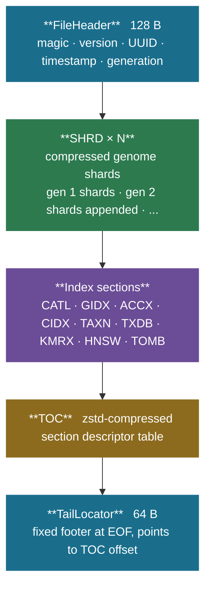
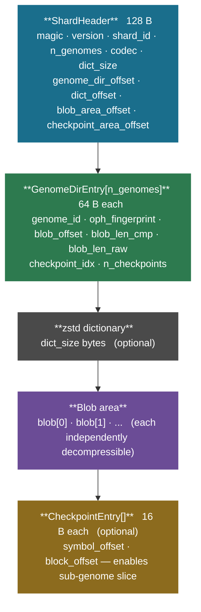
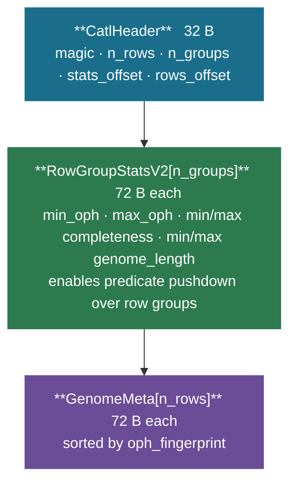

# Binary Format

A `.gpk` file is a **seekable single-file container** inspired by Parquet. Sections can be appended without rewriting existing data, and the TOC at the end is updated with each generation. A 64-byte `TailLocator` at EOF points to the current TOC, allowing the reader to open the archive with two seeks.

---

## File layout



Old generation shards are never rewritten; each `add` or `repack` appends new shard sections and writes a fresh TOC.

---

## Section types

| Magic | Name | Description |
|-------|------|-------------|
| `SHRD` | Shard | Compressed genome blobs + directory |
| `CATL` | Catalog | Columnar genome metadata (SoA, sorted by oph) |
| `GIDX` | Genome index | genome_id to (section_id, dir_index, catl_row) |
| `ACCX` | Accession index | FNV-1a hash table: accession string to genome_id |
| `CIDX` | Contig index | Sorted (FNV-1a-64(contig_acc), genome_id) array |
| `TAXN` | Taxonomy strings | FNV-1a hash table: accession to lineage string |
| `TXDB` | Taxonomy tree | Parsed taxid/parent/rank/name nodes + acc to taxid |
| `KMRX` | K-mer profiles | float[n x 136] L2-normalised k=4 tetranucleotide frequencies |
| `HNSW` | HNSW index | hnswlib serialised blob + label map (genome_id per vector) |
| `TOMB` | Tombstone | Soft-deleted genome_id records |

---

## Shard layout (`SHRD`)

Each shard section starts with a 128-byte `ShardHeader`, followed by the genome directory, an optional dictionary, and the blob area.



Genomes are sorted by `oph_fingerprint` within each shard. Nearby OPH values indicate similar k-mer content, which maximises zstd LDM reuse and shared dictionary effectiveness.

### Codec field

| Value | Codec | Description |
|-------|-------|-------------|
| 0 | `PLAIN` | Each blob is independent zstd |
| 1 | `ZSTD_DICT` | Shared dictionary trained on first N genomes |
| 2 | `REF_DICT` | First genome used as reference content dictionary |
| 3 | `DELTA` | Non-reference blobs zstd-compressed with `refPrefix` from genome 0 |
| 4 | `MEM_DELTA` | Seed with k=31 k-mers; store MEM list + zstd verbatim residue |

---

## Catalog section (`CATL`)

The catalog stores `GenomeMeta` rows in a columnar struct-of-arrays layout, sorted by `oph_fingerprint`. Row-group statistics (min/max OPH, completeness, genome_length) enable predicate pushdown - scans can skip entire row groups without accessing individual rows.



Multiple CATL fragments (one per generation) are merged by `MergedCatalogReader` at read time; newer fragments take precedence on duplicate `genome_id`.

---

## Genome index (`GIDX`)

Maps `genome_id` to its physical location for O(1) fetch:

```
genome_id  ->  (section_id, dir_index, catl_row_index)
```

`section_id` is looked up in the TOC to find the shard section's file offset. `dir_index` is the position in `GenomeDirEntry[]`. `catl_row_index` is the row in the merged catalog.

---

## TOC and TailLocator

The Table of Contents is a zstd-compressed array of `SectionDesc` records. Each record describes one section:

```cpp
struct SectionDesc {
    uint32_t type;              // section magic (e.g. SEC_SHRD)
    uint16_t version;
    uint16_t flags;
    uint64_t section_id;        // unique, monotonically increasing
    uint64_t file_offset;
    uint64_t compressed_size;
    uint64_t uncompressed_size;
    uint64_t item_count;        // genomes in a shard, rows in a catalog, etc.
    uint64_t aux0;              // type-specific (shard_id for SHRD)
    uint64_t aux1;
    uint8_t  checksum[16];
};
```

The 64-byte `TailLocator` at EOF contains the TOC file offset and a file UUID, allowing the reader to open the archive with:

1. `lseek(-64, SEEK_END)` to read `TailLocator`
2. `lseek(toc_offset, SEEK_SET)` to read and decompress TOC
3. Parse section descriptors and mmap the entire file

---

## Versioning

| Field | Description |
|-------|-------------|
| `FileHeader.version_major` | Breaking format change |
| `FileHeader.version_minor` | Backward-compatible extension |
| `FileHeader.generation` | Monotonically incremented on each `add`/`rm`/`repack` |
| `SectionDesc.version` | Per-section format version (e.g. shard v4 added checkpoints) |

---

## KMRX section

Stores L2-normalised k=4 canonical tetranucleotide frequency vectors (136 dimensions, not 256, because reverse-complement collapsing reduces unique k-mers). Layout:

```cpp
KmrxHeader              // 32 B
uint64_t genome_ids[n]  // sorted ascending
float    profiles[n][136] // parallel to genome_ids
```

Lookup is O(log n) binary search on the sorted `genome_ids` array. Profiles are stored uncompressed (float data compresses poorly).

---

## HNSW section

Embeds a serialised [hnswlib](https://github.com/nmslib/hnswlib) index blob with a label map that translates hnswlib internal labels back to `genome_id` values. Default build parameters: M=16, efConstruction=200.

```cpp
HnswSectionHeader       // 64 B
// hnswlib serialised index blob
uint64_t label_map[n]   // label i -> genome_id
```
