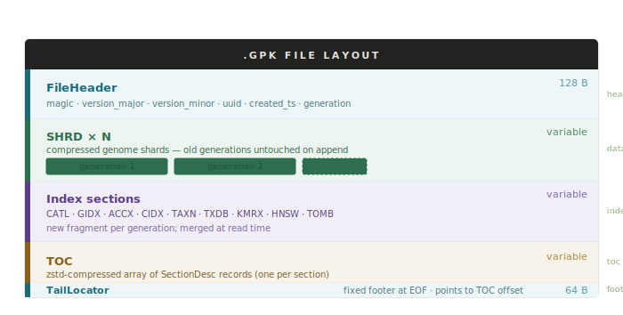
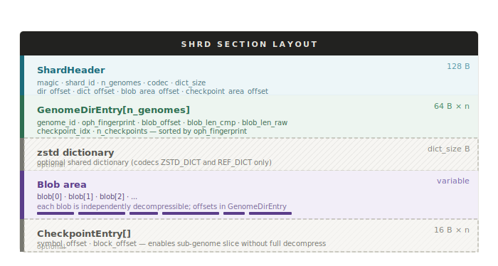
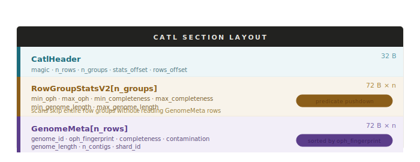

# Binary Format

A `.gpk` file is a seekable single-file container inspired by Parquet. The `TailLocator` fixed footer at EOF points to the current TOC, so the reader needs only two seeks to open any archive. Sections are appended across generations without rewriting existing data.

---

## File layout



| Section | Size | Description |
|---------|------|-------------|
| `FileHeader` | 128 B | Magic, version, UUID, creation timestamp, generation counter |
| `SHRD` × N | variable | Compressed genome shards. Each `add`/`repack` appends new shards; old shards are never modified |
| Index sections | variable | `CATL` · `GIDX` · `ACCX` · `CIDX` · `TAXN` · `TXDB` · `KMRX` · `HNSW` · `TOMB` (one or more of each, one per generation) |
| `TOC` | variable | zstd-compressed array of `SectionDesc` records describing every section in the file |
| `TailLocator` | 64 B | Fixed footer at EOF; contains TOC file offset + archive UUID. Read with `lseek(-64, SEEK_END)` |

---

## Section types

| Magic | Name | Description |
|-------|------|-------------|
| `SHRD` | Shard | Compressed genome blobs and directory |
| `CATL` | Catalog | Columnar genome metadata (SoA, sorted by oph) |
| `GIDX` | Genome index | genome_id to (section_id, dir_index, catl_row) |
| `ACCX` | Accession index | FNV-1a hash table: accession string to genome_id |
| `CIDX` | Contig index | Sorted (FNV-1a-64(contig_acc), genome_id) array |
| `TAXN` | Taxonomy strings | FNV-1a hash table: accession to lineage string |
| `TXDB` | Taxonomy tree | Parsed taxid/parent/rank/name nodes + acc-to-taxid table |
| `KMRX` | K-mer profiles | float[n × 136] L2-normalised k=4 tetranucleotide frequencies |
| `HNSW` | HNSW index | hnswlib serialised blob + label map (genome_id per vector) |
| `TOMB` | Tombstone | Soft-deleted genome_id records |

---

## `FileHeader` — 128 bytes

| Offset | Size | Field | Description |
|--------|------|-------|-------------|
| 0 | 4 B | `magic` | `GPK\x01` |
| 4 | 2 B | `version_major` | Breaking format change |
| 6 | 2 B | `version_minor` | Backward-compatible extension |
| 8 | 16 B | `uuid` | Archive UUID (stable across generations) |
| 24 | 8 B | `created_ts` | Unix timestamp of initial build |
| 32 | 8 B | `generation` | Monotonically incremented on each `add`/`rm`/`repack` |
| 40 | 88 B | _reserved_ | Zero-padded |

---

## Shard section (`SHRD`)



### `ShardHeader` — 128 bytes

| Offset | Size | Field | Description |
|--------|------|-------|-------------|
| 0 | 4 B | `magic` | `SHRD` |
| 4 | 2 B | `version` | |
| 6 | 2 B | `codec` | Compression codec (see table below) |
| 8 | 8 B | `shard_id` | Unique shard identifier |
| 16 | 4 B | `n_genomes` | Number of genomes in this shard |
| 20 | 4 B | `dict_size` | Dictionary size in bytes (0 if none) |
| 24 | 8 B | `genome_dir_offset` | Byte offset of `GenomeDirEntry[]` from section start |
| 32 | 8 B | `dict_offset` | Byte offset of zstd dictionary |
| 40 | 8 B | `blob_area_offset` | Byte offset of blob area |
| 48 | 8 B | `checkpoint_area_offset` | Byte offset of `CheckpointEntry[]` (0 if none) |
| 56 | 72 B | _reserved_ | Zero-padded |

After the header: `GenomeDirEntry[n_genomes]`, then the optional zstd dictionary, then the blob area, then optional checkpoint entries.

### `GenomeDirEntry` — 64 bytes each

| Offset | Size | Field | Description |
|--------|------|-------|-------------|
| 0 | 8 B | `genome_id` | |
| 8 | 8 B | `oph_fingerprint` | Order-preserving hash; entries sorted by this value |
| 16 | 8 B | `blob_offset` | Byte offset of compressed blob from blob area start |
| 24 | 8 B | `blob_len_cmp` | Compressed size in bytes |
| 32 | 8 B | `blob_len_raw` | Uncompressed size in bytes |
| 40 | 4 B | `checkpoint_idx` | Index into `CheckpointEntry[]` for first checkpoint of this genome |
| 44 | 4 B | `n_checkpoints` | Number of checkpoints (0 if `slice` not needed) |
| 48 | 16 B | _reserved_ | |

Genomes are sorted by `oph_fingerprint`. Nearby OPH values indicate similar k-mer content, maximising zstd LDM reuse and shared dictionary effectiveness.

### `CheckpointEntry` — 16 bytes each (optional)

| Offset | Size | Field | Description |
|--------|------|-------|-------------|
| 0 | 8 B | `symbol_offset` | Byte offset within the decompressed genome at which this checkpoint starts |
| 8 | 8 B | `block_offset` | Byte offset of the corresponding zstd block within the compressed blob |

Checkpoints enable `genopack slice` to decompress only the blocks covering a requested region, without decompressing the entire genome.

### Codec values

| Value | Name | Description |
|-------|------|-------------|
| 0 | `PLAIN` | Each blob is independent zstd |
| 1 | `ZSTD_DICT` | Shared dictionary trained on first N genomes |
| 2 | `REF_DICT` | First genome used as reference content dictionary |
| 3 | `DELTA` | Non-reference blobs zstd-compressed with `refPrefix` from genome 0 |
| 4 | `MEM_DELTA` | Seed with k=31 k-mers; store MEM list + zstd verbatim residue |

---

## Catalog section (`CATL`)



Stores `GenomeMeta` rows in a columnar struct-of-arrays layout, sorted by `oph_fingerprint`. Row-group statistics enable predicate pushdown: scans can skip entire row groups without touching individual rows.

### `CatlHeader` — 32 bytes

| Offset | Size | Field | Description |
|--------|------|-------|-------------|
| 0 | 4 B | `magic` | `CATL` |
| 4 | 4 B | `n_rows` | Total number of `GenomeMeta` rows |
| 8 | 4 B | `n_groups` | Number of row groups |
| 12 | 4 B | _reserved_ | |
| 16 | 8 B | `stats_offset` | Byte offset of `RowGroupStatsV2[]` from section start |
| 24 | 8 B | `rows_offset` | Byte offset of `GenomeMeta[]` from section start |

### `RowGroupStatsV2` — 72 bytes each

Covers a contiguous slice of `GenomeMeta` rows. Used for predicate pushdown on completeness and genome length filters.

| Offset | Size | Field |
|--------|------|-------|
| 0 | 8 B | `min_oph` |
| 8 | 8 B | `max_oph` |
| 16 | 4 B | `min_completeness` |
| 20 | 4 B | `max_completeness` |
| 24 | 8 B | `min_genome_length` |
| 32 | 8 B | `max_genome_length` |
| 40 | 32 B | _reserved_ |

### `GenomeMeta` — 72 bytes each

| Offset | Size | Field | Description |
|--------|------|-------|-------------|
| 0 | 8 B | `genome_id` | |
| 8 | 8 B | `oph_fingerprint` | |
| 16 | 4 B | `completeness` | CheckM completeness × 100 (fixed-point) |
| 20 | 4 B | `contamination` | CheckM contamination × 100 |
| 24 | 8 B | `genome_length` | Total assembly length in bp |
| 32 | 4 B | `n_contigs` | |
| 36 | 4 B | `shard_id` | Which shard holds this genome |
| 40 | 32 B | _reserved_ | |

Multiple CATL fragments (one per generation) are merged by `MergedCatalogReader` at read time; newer fragments take precedence on duplicate `genome_id`.

---

## Genome index (`GIDX`)

A flat array of fixed-size records sorted by `genome_id`, enabling O(log n) binary search. Each record maps:

```
genome_id  ->  (section_id, dir_index, catl_row_index)
```

`section_id` is resolved via the TOC to find the shard's file offset. `dir_index` is the entry's position in `GenomeDirEntry[]`. `catl_row_index` is the row in the merged catalog.

---

## TOC and TailLocator

The TOC is a zstd-compressed array of `SectionDesc` records.

### `SectionDesc`

```cpp
struct SectionDesc {
    uint32_t type;              // section magic (e.g. SEC_SHRD)
    uint16_t version;
    uint16_t flags;
    uint64_t section_id;        // unique, monotonically increasing
    uint64_t file_offset;
    uint64_t compressed_size;
    uint64_t uncompressed_size;
    uint64_t item_count;        // genomes in a shard, rows in a catalog, etc.
    uint64_t aux0;              // type-specific (shard_id for SHRD)
    uint64_t aux1;
    uint8_t  checksum[16];
};
```

### Open sequence

1. `lseek(-64, SEEK_END)` — read the 64-byte `TailLocator`
2. `lseek(toc_offset, SEEK_SET)` — read and decompress the TOC
3. Parse `SectionDesc[]` — mmap the entire file

---

## KMRX section

Stores L2-normalised k=4 canonical tetranucleotide frequency vectors (136 dimensions; reverse-complement collapsing reduces unique k-mers from 256 to 136).

| Offset | Size | Field | Description |
|--------|------|-------|-------------|
| 0 | 32 B | `KmrxHeader` | magic, n_genomes, flags |
| 32 | n × 8 B | `genome_ids[n]` | Sorted ascending; binary search for O(log n) lookup |
| 32 + n×8 | n × 136 × 4 B | `profiles[n][136]` | Parallel to `genome_ids`; stored uncompressed |

---

## HNSW section

Embeds a serialised [hnswlib](https://github.com/nmslib/hnswlib) index blob. Default build parameters: M=16, efConstruction=200.

| Offset | Size | Field | Description |
|--------|------|-------|-------------|
| 0 | 64 B | `HnswSectionHeader` | magic, n_elements, M, efConstruction |
| 64 | variable | hnswlib blob | Serialised hnswlib index |
| 64 + blob | n × 8 B | `label_map[n]` | Translates hnswlib internal label i to `genome_id` |
